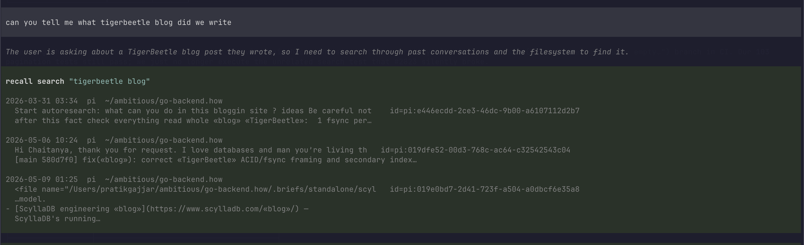

# recall

> Your AI chat history, searchable. Across Cursor, Claude Code, Codex, and pi.
> Really fast. Read-only. No copies.

`recall` indexes the conversations you've already had with Cursor, Claude Code,
OpenAI Codex CLI, and pi — straight from their native storage. It does not move,
copy, or modify your data. It builds a tiny searchable index over excerpts and
metadata, and lets you grep the lot from your terminal.



_Above: the [pi extension](packages/pi-recall) lets an agent call `recall_search`
to find a past conversation and read it back — no copy-paste._

```
$ recall doctor
recall 0.1.0

sources:
  ✓ cursor  ~/Library/Application Support/Cursor/User/globalStorage/state.vscdb
  ✓ claude  ~/.claude/projects
  ✓ codex   ~/.codex/sessions

index: ~/.recall/index.sqlite (69.5 MiB)
  cursor  1514 sessions
  claude    25 sessions
  codex   1058 sessions
  total   2597 sessions

$ recall "import cycle" --limit 3
2025-09-02 18:36  cursor  ~/code/acme-api    Fix import cycle in proto files
    id=cursor:94dc8775-5fd3-41e9-93d7-43d7dff795b6  msg=1  role=assistant
    I'll help you fix the «import» «cycle» in the request logging…

$ recall last --repo ~/code/acme-api | claude -p "continue this"
```

## Install

```bash
# one-line installer (downloads the right prebuilt binary)
curl -fsSL https://raw.githubusercontent.com/pratikgajjar/recall/main/install.sh | sh

# …or with Go
go install github.com/pratikgajjar/recall@latest

# …or grab a binary from https://github.com/pratikgajjar/recall/releases
```

Then build the index once:

```bash
recall index           # one-time, ~1 minute on real data
recall doctor
recall <query>
```

Pure Go, no CGO. Builds a single static binary.

## Use it in your agent (MCP)

`recall mcp` is a [Model Context Protocol](https://modelcontextprotocol.io)
server over stdio, so any MCP-capable harness can search your past chats. It
exposes `recall_search`, `recall_transcript`, `recall_sessions`, and
`recall_related`, and keeps the index warm in the background.

**Claude Code**

```bash
claude mcp add recall -- recall mcp
```

**Codex** — add to `~/.codex/config.toml`:

```toml
[mcp_servers.recall]
command = "recall"
args = ["mcp"]
```

**Cursor / Cline / Windsurf** — add to the client's `mcp.json`
(e.g. `~/.cursor/mcp.json`):

```json
{
  "mcpServers": {
    "recall": { "command": "recall", "args": ["mcp"] }
  }
}
```

**pi** — use the native extension instead (no MCP needed):
`pi install npm:@pratikgajjar/pi-recall` ([packages/pi-recall](packages/pi-recall)).

Once connected, ask the agent things like _"use recall to find how we fixed the
import cycle"_ and it will search and read the relevant past session.

## Commands

```
recall index                       (re)build the index from all sources
recall <query>                     search; prints ranked hits
recall find <query> [--repo P]     same, with filters
recall last [--repo P]             dump the most recent session as transcript
recall show <session-id>           dump one session as transcript
recall sessions [--repo P]         list recent sessions
recall related <session-id>        sessions on the same topic
recall mcp                         run an MCP server (Claude Code, Codex, Cursor, …)
recall doctor                      health check
```

Flags can appear anywhere on the line:

```
--repo PATH      restrict to a project folder
--source NAME    cursor | claude | codex
--since DURATION e.g. 24h, 7d, 30d
--limit N        default 30
--json           machine-readable output
```

## What it reads

| Tool | Storage | Notes |
|---|---|---|
| Cursor | `~/Library/Application Support/Cursor/User/globalStorage/state.vscdb` and per-workspace `state.vscdb` | Walks `composerData:*` + `bubbleId:*` blobs; joins to workspace folder via `workspaceStorage/*/workspace.json` |
| Claude Code | `~/.claude/projects/<sanitized-cwd>/*.jsonl` | One file per session, append-only JSONL |
| Codex CLI | `~/.codex/sessions/YYYY/MM/DD/rollout-*.jsonl` | First line is `session_meta`; rest are `response_item` payloads |
| pi | `~/.pi/agent/sessions/<sanitized-cwd>/*.jsonl` | First line is the `session` event; rest are `message` events |

The index lives at `~/.recall/index.sqlite`. It contains:

- `sessions(id, source, source_id, project, title, started_at, msg_count, …)`
- `messages_fts(session_pk, idx, role, ts, text)` — SQLite FTS5 over excerpts (trimmed to ~1.5 KB per message)

Nuke `~/.recall/` and re-run `recall index` any time. The index is disposable.

## Design

- **Read-only.** Sources stay the source of truth.
- **No materialization.** No markdown copies, no canonical schema migrations.
- **One binary.** Single Go executable, ~10 MB, no CGO.
- **SQLite + FTS5** for search. `bm25` ranking with a small recency lift.
- **Adapter trait.** Add a new tool = implement one interface (`Adapter` in `types.go`).

Inspired by [`fff`](https://github.com/dmtrKovalenko/fff)'s pattern: thin index,
live source reads, MCP-as-peer.

## Status

v0.1. Incremental indexing (append-only), an MCP server, and the pi extension
all work. A filesystem watcher and a TUI are next.

## Licence

MIT.
